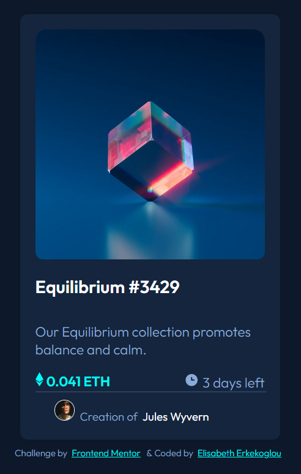

# Frontend Mentor - NFT preview card component solution

This is a solution to the [NFT preview card component challenge on Frontend Mentor](https://www.frontendmentor.io/challenges/nft-preview-card-component-SbdUL_w0U). Frontend Mentor challenges help you improve your coding skills by building realistic projects.

## Table of contents

- [Overview](#overview)
  - [The challenge](#the-challenge)
  - [Screenshot](#screenshot)
  - [Links](#links)
- [My process](#my-process)
  - [Built with](#built-with)
  - [What I learned](#what-i-learned)
  - [Continued development](#continued-development)
  - [Useful resources](#useful-resources)
- [Author](#author)
- [Acknowledgments](#acknowledgments)

## Overview

### The challenge

Users should be able to:

- View the optimal layout depending on their device's screen size
- See hover states for interactive elements

### Screenshot

Here are some screenshots of the app :



Active state :


### Links

- Solution URL: [Add solution URL here](https://your-solution-url.com)
- Live Site URL: [Add live site URL here](https://your-live-site-url.com)

## My process

### Built with

- Semantic HTML5 markup
- CSS custom properties
- Flexbox
- CSS Grid
- Mobile-first workflow
- [Styled Components](https://styled-components.com/) - For styles

### What I learned

I learned more about flexbox and Grid. I also learned how to use styled-components. I also learned how to use the:hover pseudo-class and how to use the transform property.

To see how you can add code snippets, see below:

```HTML
<h1>Some HTML code I'm proud of</h1>
```

```css
view {
  transition: 0.5s ease;
  opacity: 0;
  position: absolute;
  top: 35%;
  left: 50%;
  transform: translate(-50%, -50%);
  -ms-transform: translate(-50%, -50%);
  text-align: center;
  color: var(--white);
  margin-top: 20px;
}
```

```css
overlay {
  position: absolute;
  top: 0;
  left: 0;
  width: 100%;
  height: 100%;
  background-color: cyan;
  opacity: 0;
  display: flex;
  justify-content: center;
  align-items: center;
}
```

### Continued development

I will continue to learn more about Flexbox and grid. I will also learn more about styled-components. I will also know more about the transform property.

### Useful resources

- [Color overlay on hover image ](https://stackoverflow.com/questions/40292168/color-overlay-on-hover-image) - This helped me to understand how to use the overlay on CSS. I really liked this pattern and will use it going forward.

- [CSS Image Overlay](https://www.w3schools.com/howto/howto_css_image_overlay.asp) - This is a fantastic article that helped me understand this concept better.

## Author

- Website - [Elisabeth Erkekoglou ](https://www.linkedin.com/in/eerkekoglou/)
- Frontend Mentor - [@elic4vet](https://www.frontendmentor.io/profile/elic4vet)
- Instagram - [@elisa.codes23](https://www.instagram.com/elisa.codes23/)
